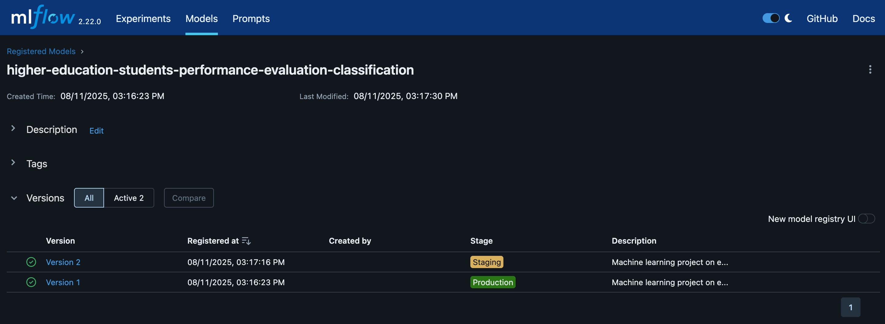
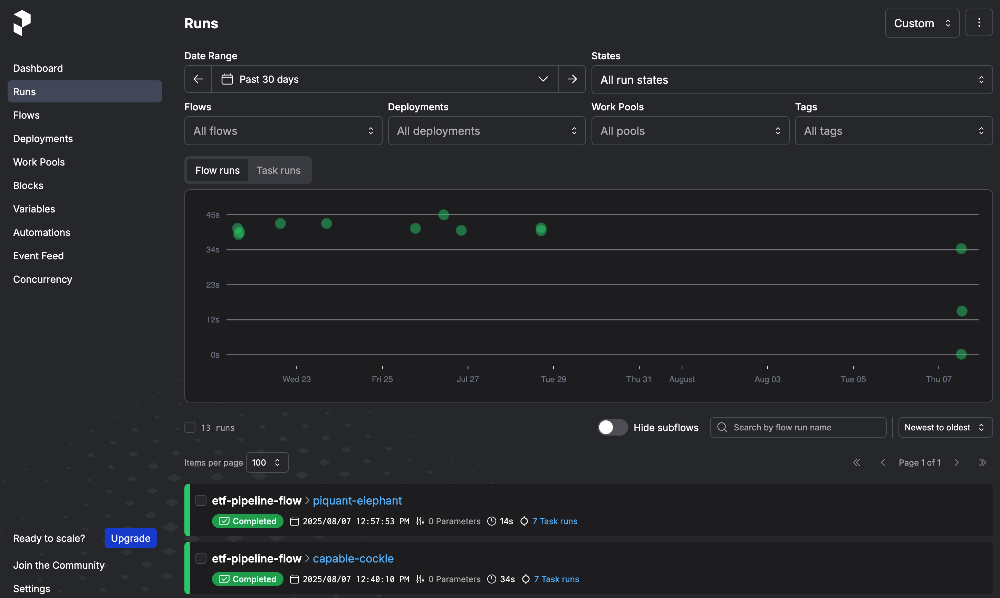

# Higher Education Students Performance Evaluation

This is my capstone project for the [Machine Learning Operations Zoomcamp](https://datatalks.club/blog/mlops-zoomcamp.html "https://datatalks.club/blog/mlops-zoomcamp.html"), which is a free, online course offered by [DataTalks.Club](https://datatalks.club/ "https://datatalks.club/").

## Summary

<p align="center">
    
</p>

<p align="center">
Photo by <a href="https://unsplash.com/photos/three-round-white-wooden-tables-n4y3eiQSIoc">Drahomír Hugo Posteby-Mach</a> on Unsplash.
</p>

The purpose of this capstone project is to predict higher eduction students' end-of-term performances using machine learning operations techniques. The dataset employed in this MLOps Zoomcamp project is the [Higher Education Students Performance Evaluation dataset](https://archive.ics.uci.edu/dataset/856/higher+education+students+performance+evaluation "https://archive.ics.uci.edu/dataset/856/higher+education+students+performance+evaluation") from the UCI Machine Learning Repository. The paper derived from the dataset is [Student Performance Classification Using Artificial Intelligence Techniques](https://www.semanticscholar.org/paper/d2540a82aea0f5acef91c8b4f92295ff8f312404 "https://www.semanticscholar.org/paper/d2540a82aea0f5acef91c8b4f92295ff8f312404").

The dataset includes 145 instances in 31 features. The first ten features of the data regard personal questions, features 11 to 16 regard family questions, and the remaining features are about education habits. The dataset doesn't contain missing values, and is entirely made of categorical values. The data was collected from the Faculty of Engineering and Faculty of Educational Sciences students in 2019. 


## Outline

Here is an outline of the project folder with the work I've done for this capstone project.

```bash
├── best-practices         # Reports & logs for code quality checks
│   └── tests              # Software test files
├── data                   # CSV and Parquet data files
├── deployment             # Folder for model deploying with MLflow registry & Flask
│   ├── artifacts          # MLflow artifacts folder for model registry
│   └── flask-app          # Local Flask deployment folder
├── experiment-tracking    # Folder for experiment tracking with MLflow
│   └── artifacts          # MLflow artifacts folder for model registry
├── models                 # Folder containing best model & preprocessor
├── monitoring             # Monitoring folder for Evidently
│   └── config             # Configuration folder for Evidently
├── orchestration          # Prefect orchestration folder
├── plots                  # Exploratory data analysis plots folder
└── screenshots            # Folder for screen shots of MLflow, Prefect, Evidently and Grafana
```


In order to reproduce the outcome of this project, clone this repository locally to your computer and create a Anaconda environment using the `environment.yml` file with the command 

```bash
conda env create -f environment.yml
```

This will create an environment called `mlops-zoomcamp` where you will have the package versions I used. If not, you can use the `requirements.txt` file and install the packages using `pip install -r requirements.txt`. The data itself is saved in the `data` folder. It is made up of CSV and Parquet files. Moreover, the dataframe makes use of the `attribute_names.json` file for column naming.

## Exploratory data analysis

I've completed some exploratory data analysis to get a feel for the categorical data set. These results are saved in the `plots` folder, and have been generated with the `eda.py` script. Here I show the `Grade output` category bar plot.

<p align="center">
    
</p>

The other plot in the folder shows the bar plot of the other categorical attributes.


### Experiment tracking with MLflow

In the `experiment-tracking` folder, I've implemented MLflow experiment tracking to generate the best model from the data set. I've experimented several Scikit-Learn models and one with XGBoost, and decided to settle with the XGBoost model since it returned the best [area under the curve (AUC)](https://en.wikipedia.org/wiki/Receiver_operating_characteristic#Area_under_the_curve "https://en.wikipedia.org/wiki/Receiver_operating_characteristic#Area_under_the_curve") which is the metric I used to determine the best model. The experimentation search space is saved locally using MLflow.

In order to reproduce the experiment outcome, follow this sequence of commands. Inside the `experiment-tracking` folder, open a terminal and run:

```bash
mlflow ui --backend-store-uri sqlite:///mlflow.db --default-artifact-root artifacts
```

You can open the MLflow UI in a browser with [http://127.0.0.1:5000](http://127.0.0.1:5000) and see the experiments listed under `higher-education-students-performance-evaluation`.

<p align="center">
    
</p>

<p align="center">
Here is a sample of some of the model experiments saved in MLflow.
</p>

 If you re-run the experimentation script used previously, you'll just add the same runs to MLflow. You can try this out yourself by opening another terminal in the same folder and running:

```bash
python experimentation.py
```

<p align="center">
    
</p>

<p align="center">
Here are two models saved in the MLflow registry, one to production and the another to staging.
</p>

### Deployment using MLflow

You can test the code in the `deployment` folder by creating an isolated environment with `pipenv`, using the `Pipfile` and `Pipfile.lock` files. Once the environment has been generated, run `pipenv shell` and run the following command to launch the Flask web service for making predictions:

```bash
python predict.py
```
This script doesn't require a running instance of the MLflow server, but simply retrieves the registered model from the registry.

In a second terminal and in the same Pipenv environment, run the `test.py` Python script to test the prediction web service, using new student test data contained in the test script itself:

```bash
python test.py
```

#### Flask web service

I wanted to test the predictions of my model using a Flask app. You can find the files for testing in the `deployment/flask-app` folder. Once you've set up a local environment by running `pipenv install` in the same folder with the `Pipfile` and `Pipfile.lock` files, and then running `pipenv shell`, run `python predict.py` in one terminal and `python test.py` in the other folder using the same Pipenv environment.


### Orchestration with Prefect

In this project data pipelines were implemented using the latest version of Prefect, 3.4.11 at this time of this writing. In order to reproduce the workflow, go to the `orchestration` folder, open a terminal and run the following commands:

```bash
prefect server start
```

The Prefect UI can be accessed locally at http://127.0.0.1:4200. In order for Prefect to communicate with the server, run the following configuration setting in a separate terminal:

```bash
prefect config set PREFECT_APT_URL=http://127.0.0.1:4200/api
```

You may need to initialize a Prefect project, so run `prefect init` to initialize your deployment configuration with a pre-defined recipe. Use arrows to move to choose the `git` option deployment, which is what I chose.

For deployment on a local server, you need to create a Prefect worker to poll from the work pool. In order activate the Prefect worker, run in the same terminal:

```bash
prefect worker start --pool "hespe-pool"
```

This will output a message of a running worker with its ID. In my case I had:
```
Discovered type 'process' for work pool 'hespe-pool'.
Worker 'ProcessWorker ddd94b59-d586-46c0-a31c-77d040b3fef7' started!
```

<p align="center">
    
</p>

<p align="center">
Here are some runs I've generated in the past 30 days and saved in the Prefect Runs tab.
</p>

 Finally in a third terminal to deploy the flow, run:

```bash
prefect deploy orchestration.py:main_flow -n hespe-1 -p hespe-pool
```

You'll see the worker named `hespe-1` activate the `orchestration.py` flow automatically, and you'll be able to observe the flow output in the Prefect UI.

<p align="center">
    
</p>

<p align="center">
Here are deployments saved over the past 30 days and saved in the Prefect work pool.
</p>

 You can also run the deployment in the Prefect UI with the Quick run button. If you still have MLflow up and running in its original terminal tab, it'll get updated with new runs from the command run previously.


### Monitoring with Evidently

I've implemented local monitoring using Evidently (version 0.6.7). The data for the monitoring is saved in the `monitoring` folder. I prepared two dataframes, one for production and one for reference, and compared the two using Evidently. The data preparation is made with `data_preparation.py` script, while the monitoring is taken care of with`data_report.py` script. The output is saved in the `data_drift_report.html` and `data_stability_report.html` files, which can be easily viewed in any browser.

<p align="center">
    
</p>

<p align="center">
A sample with the first four entries of the data drift summary in Evidently.
</p>

As for Evidently monitoring, this is taken care of with the `monitoring.py` script. In order to save the data results and view then in a dashboard in Evidently, with the terminal in the `monitoring` folder, launch Docker with the command:

```bash
docker-compose up --build -d
```
Since the detached-state `-d` flag is used, in the same terminal you can run the script:

```bash
python monitoring.py
```

<p align="center">
    
</p>

<p align="center">
The single entry for prediction drift, number of drifted columns and share of missing values in Adminer.
</p>

The data is saved to Adminer and can be viewed in a dashboard in Grafana as a data table.

<p align="center">
    
</p>

<p align="center">
Here is the table of the prediction drift, number of drifted columns and share of missing values in Grafana.
</p>


### Best practices

#### Unit tests with Pytest

In the `best-practices` folder create a virtual environment by running `pipenv install`. You need to have Pytest installed in the virtual environment, so make sure it's there otherwise run `pipenv install --dev pytest`. If you use VSCode make sure you choose the `best-practices` interpreter as the virtual environment.

In the `tests` folder there is a `predict-test.py` file that you can do unit testing on using Pytest. The `test_predict` method checks to see if the output from a test entry of student data returns the expected prediction.

#### Code quality using linting and formatting

Added a `pyproject.toml` file to suppress several warnings, such as `missing-module-docstring`, `missing-function-docstring`, and `invalid-name`.

#### Makefile

Makefile for test (`pytest tests/`) and quality checks with `isort`, `black` and `pylint`.
